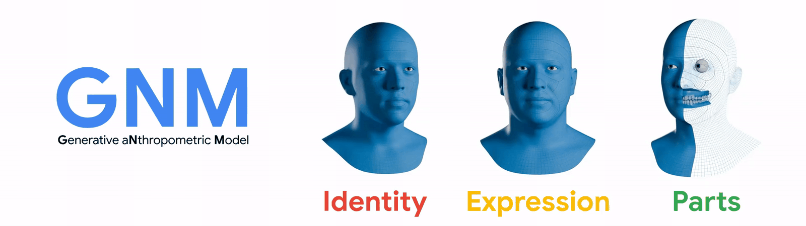
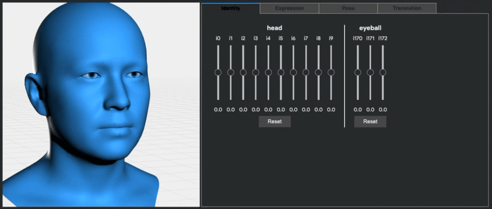
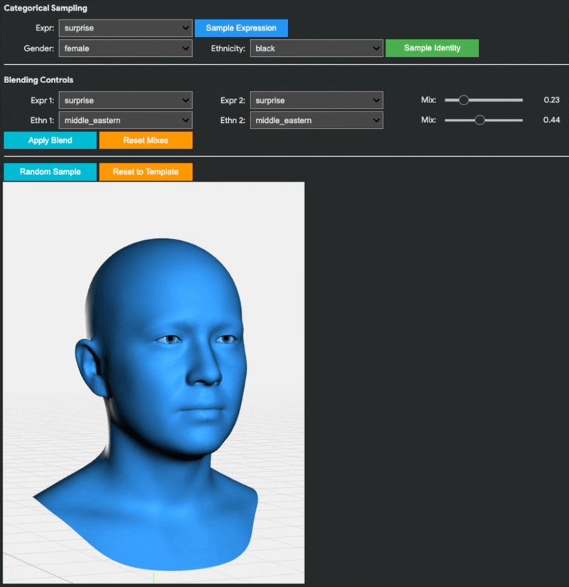
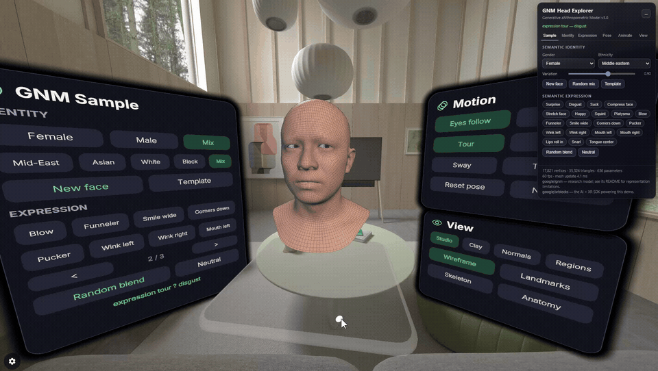
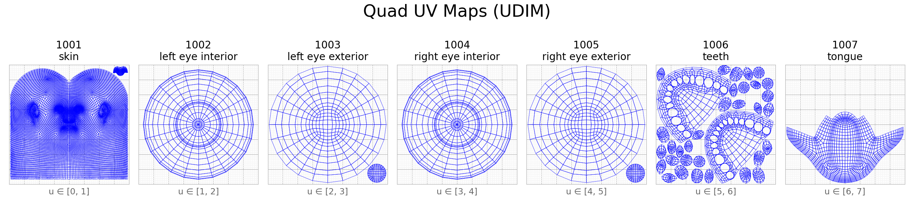
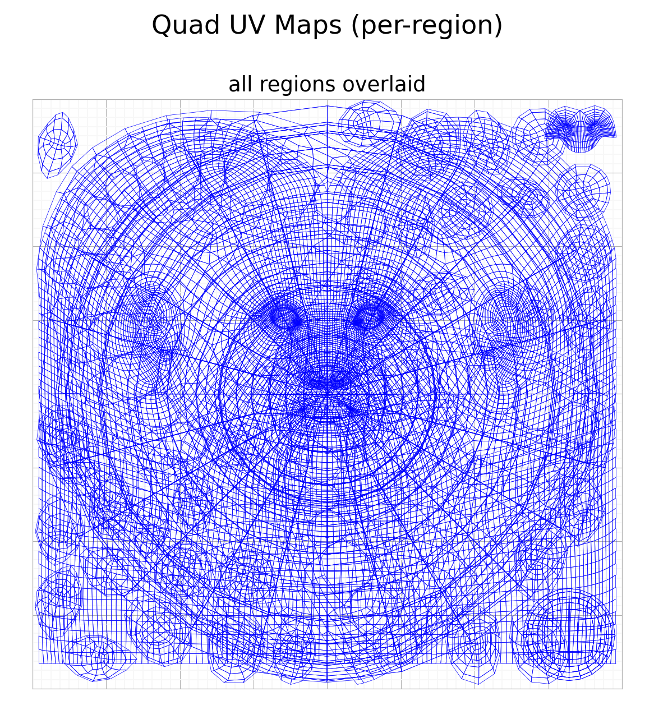

# GNM: Generative aNthropometric Model

[](https://arxiv.org/abs/2607.23687)
[](https://github.com/google/gnm/actions/workflows/ci-shape-linux.yml)
[](https://github.com/google/gnm/actions/workflows/ci-shape-macos.yml)
[](https://github.com/google/gnm/actions/workflows/ci-shape-windows.yml)
[](https://github.com/google/gnm/actions/workflows/lint.yml)

**GNM** is a state-of-the-art parametric 3D statistical model of the human head,
learned from a large dataset of 3D scans. It provides fine-grained control over
facial identity, expressions, and head pose. This package contains the core
NumPy, JAX, PyTorch, and TensorFlow based GNM shape model implementations, along
with tools for visualization and semantic sampling of parameters.



## Features

*   **Detailed 3D Face Geometry:** Generates a dense 3D face mesh comprised of the skin, the eyes, the teeth, and the tongue.
*   **Disentangled Control:** Offers separate parameters for:
    *   **Identity:** Controls subject-specific facial features.
    *   **Expression:** Animates the face with a rich set of expression blendshapes.
    *   **Head Pose:** Controls the rotation of the neck and eyeballs.
    *   **Translation:** Controls the global position.
*   **Semantic Parameter Sampling:** Includes pre-trained models to generate identity and expression parameters from semantic labels:
    *   `ExpressionSampler`: Generate expressions like "happy", "surprise", or blend them.
    *   `IdentitySampler`: Generate identities based on attributes like gender and ethnicity.
*   **UDIM Texture Layout:** Texture coordinates in the standard UDIM layout, with each region of the mesh in its own tile.
*   **Multi-Framework Support:** Native backend support for **NumPy**, **JAX**, **PyTorch**, and **TensorFlow**.
*   **Permissive License:** Apache 2.0.

## Project Structure

```text
gnm/shape/
├── data/                   # GNM model assets and versions
│   ├── textures/           # Model textures (.jpg, .png)
│   ├── semantic_sampler/   # Pre-trained .h5 semantic sampling models
│   └── versions/           # Model specifications and catalog definitions
├── demos/                  # Interactive demo notebooks (.ipynb)
├── fitting_utils/          # Shared optimization helper functions
├── visualization/          # Rendering and camera projection utilities
├── gnm_base.py             # Base GNM class definitions
├── gnm_colab_viewer.py     # Colab 3D face model visualization tool
├── gnm_data_loader.py      # Dynamic model loaders and checkers
├── gnm_data_schema.py      # Input/output data validation schemas
├── gnm_jax.py              # JAX implementation of GNM
├── gnm_numpy.py            # NumPy implementation of GNM (primary)
├── gnm_pytorch.py          # PyTorch implementation of GNM
├── gnm_tensorflow.py       # TensorFlow implementation of GNM
├── pyproject.toml          # Package build & optional dependency configuration
└── semantic_sampler.py     # Semantic parameter sampling (identities/expressions)
```

## Installation

### 1. Prerequisites
GNM Shape is tested with **Python 3.13**. Before installing, create and activate
a clean virtual environment using your preferred tool
(e.g. mamba/conda, venv, uv etc.):

```bash
mamba create -n gnm python=3.13
mamba activate gnm
```


### 2. Install GNM Shape
Clone the repository and install the package using `pip` into your active
environment. You can install only the backend frameworks you need:

```bash
git clone https://github.com/google/gnm.git
cd gnm/gnm/shape
```

*   **Core (NumPy + TensorFlow only):**

    ```bash
    pip install -e .
    ```

*   **With JAX support:**

    ```bash
    pip install -e ".[jax]"
    ```

*   **With PyTorch support:**

    ```bash
    pip install -e ".[pytorch]"
    ```

*   **All supported frameworks and development tools:**

    ```bash
    pip install -e ".[all,dev]"
    ```

## Getting Started

### Loading the GNM Model

The core model can be loaded as follows. Model weights are downloaded
automatically on first use from remote CDNs (such as Hugging Face Hub or
Kaggle Models) and cached locally (in `~/.cache/gnm/models/` by default).

```python
from gnm.shape import gnm_numpy
from gnm.shape import semantic_sampler
import numpy as np
import trimesh # For visualization

# Load the GNM head model (automatically downloads from CDN on first run).
gnm = gnm_numpy.GNM.from_remote(
    version=gnm_numpy.GNMMajorVersion.V3,
    variant=gnm_numpy.GNMVariant.HEAD,
)

# Get the template (average) face mesh.
template_vertices = gnm.template_vertex_positions
faces = gnm.triangles

# Save or visualize the mesh (example using trimesh).
mesh = trimesh.Trimesh(vertices=template_vertices, faces=faces, process=False)
# mesh.show()
mesh.export("template_face.obj")
```

### Loading a GNM Model from a Custom File

A GNM model can also be loaded from a local `.npz` model file (e.g. one that
you downloaded manually). The file must contain all the GNM model fields;
unknown extra fields are ignored with a warning.

```python
gnm = gnm_numpy.GNM.from_custom_file("/path/to/gnm_head.npz")
```

### Basic Parameter Manipulation
You can generate a mesh by providing parameters for identity, expression,
joint rotations, and translation.

```python
import trimesh

# Zero parameters result in the template face.
identity = np.zeros(gnm.identity_dim)
expression = np.zeros(gnm.expression_dim)
rotations = np.zeros((gnm.num_joints, 3)) # Axis-angle
translation = np.zeros((3,))

vertices = gnm(identity, expression, rotations, translation)
mesh = trimesh.Trimesh(vertices=vertices, faces=faces, process=False)
mesh.show()
```

### Demo

To experiment with generating a human head mesh from custom identity,
expression, joint rotations and global translation, please see
`gnm/shape/demos/gnm_head_demo.ipynb`.



## Using the Semantic Sampler
Generate meaningful identity and expression parameters using the
`ExpressionSampler` and `IdentitySampler`.

### Expression Sampling
```python
expr_sampler = semantic_sampler.ExpressionSampler()

# Available expression labels.
print(expr_sampler.expression_label_mapping)

# Sample a 'happy' expression.
happy_expression = expr_sampler.sample_expression(
    semantic_sampler.Expression.HAPPY, num_samples=1
)[0]

vertices_happy = gnm(expression=happy_expression)
mesh_happy = trimesh.Trimesh(vertices=vertices_happy, faces=faces)
mesh_happy.show()
mesh_happy.export("happy_face.obj")
```

### Identity Sampling
```python
id_sampler = semantic_sampler.IdentitySampler()

# Explain available classes.
print(id_sampler.explain_classes())

# Sample a specific identity.
identity_sample = id_sampler.sample_identity(
    semantic_sampler.Gender.FEMALE,
    semantic_sampler.Ethnicity.ASIAN,
    num_samples=1
)[0]

vertices_identity = gnm(identity=identity_sample)
mesh_identity = trimesh.Trimesh(vertices=vertices_identity, faces=faces)
mesh_identity.show()
mesh_identity.export("sampled_identity_face.obj")
```

### Demo
To experiment with identity and expression sampling and blending, please see
`gnm/shape/demos/semantic_gnm_demo.ipynb`.



## XR Blocks Demo

Check out the interactive [XR Blocks GNM Head Demo](https://xrblocks.github.io/docs/samples/GNM-Head/) (courtesy of Ruofei Du), which works on XR devices (best in Android XR), mobile phones as well as desktop browser. The demo showcases the GNM Head model including 3D face geometry, identity and expression parameter tuning, and semantic sampling. The source code can be found on [github.com/google/xrblocks/tree/main/demos/gnm](https://github.com/google/xrblocks/tree/main/demos/gnm)



## Model Parameters

The GNM model is controlled by two primary sets of coefficients that determine
the identity and expression of the generated face. The following dimensions are
relevant for the GNM v3.x.

### Identity Parameters

*   **Shape:** `[batch_size, 253]`
*   **Description:** Controls the unique physical characteristics of the individual. These are divided into:
    *   **170** Head components
    *   **3** Eyeball components
    *   **80** Teeth components
*   **Total:** 253 identity components.
*   **Typical Range:** -3 to +3

### Expression Parameters

*   **Shape:** `[batch_size, 383]`
*   **Description:** Controls the facial movement and blendshape weights. These are divided into:
    *   **100** Left eye components
    *   **100** Right eye components
    *   **150** Lower face components
    *   **32** Tongue components
    *   **1** Iris component
*   **Total:** 383 expression components.
*   **Typical Range:** -3 to +3.

### Joint Parameters

*   **Shape:** rotations: `[batch_size, num_joints, 3]` (axis-angle), global translation: `[batch_size, 3]`
*   **Description:** Controls the global head position and joint angles for head pose and eyeball orientation.

## Model Data
The GNM model data (e.g., `gnm_head.npz`) contains the template shape, identity
basis, expression basis, skinning weights, and UV layout. The model weights are
hosted on public CDNs (Hugging Face Hub and Kaggle Models) and downloaded via
`GNM.from_remote(...)`. Downloaded models are cached locally in
`~/.cache/gnm/models/` (or a custom directory specified via `cache_dir`).
Loaded models are not cached in memory: every `from_*` call (except `from_gnm`)
reads the model file again and returns a new, independent instance. To reuse a
model, keep the returned instance (or create backend conversions from it with
`from_gnm`).

The Semantic Sampler models
(`expression_decoder_model.h5`, `identity_decoder_model.h5`) are located
in `gnm/shape/data/semantic_sampler`.

## UV Mapping

GNM provides texture coordinates for both the quad topology and the
triangulated topology, in two layouts:

| Layout | Quads | Triangles | Status |
| :--- | :--- | :--- | :--- |
| **UDIM** | `quad_uvs_udim`, `[Q, 4, 2]` | `triangle_uvs_udim`, `[T, 3, 2]` | **Recommended** |
| Per-region | `quad_uvs`, `[Q, 4, 2]` | `triangle_uvs`, `[T, 3, 2]` | Legacy |

Both describe the same unwrapping of each region: they differ only in where
each region sits in the UV plane. The UDIM layout gives every region its own
tile, whereas the per-region layout stacks all of them in the unit square,
where they overlap. **Prefer the UDIM coordinates** for all new code; the
per-region ones are kept for backward compatibility while existing textures
and pipelines migrate.

### UDIM coordinates

`quad_uvs_udim` and `triangle_uvs_udim` follow the Mari UDIM convention, as
specified for
[`UsdUVTexture`](https://openusd.org/release/spec_usdpreviewsurface.html):
each region is translated into its own tile of the UV plane, and the tile
whose lower-left corner is at integer coordinate `(u, v)` is numbered
`1001 + u + 10 * v`. GNM uses tiles `1001`–`1007`, a single row, well within
the `[1001, 1100]` range that USD stipulates for interchange.

| Tile | Region | Vertex groups |
| :--- | :--- | :--- |
| 1001 | Skin: the head and face skin. | `skin` |
| 1002 | Left eye interior: sclera, pupil and iris. | `left_eye` ∩ `eye_interiors` |
| 1003 | Left eye exterior: cornea. | `left_eye` ∩ `eye_exteriors` |
| 1004 | Right eye interior: sclera, pupil and iris. | `right_eye` ∩ `eye_interiors` |
| 1005 | Right eye exterior: cornea. | `right_eye` ∩ `eye_exteriors` |
| 1006 | Teeth and gums, upper and lower. | `upper_teeth_and_gums`, `lower_teeth_and_gums` |
| 1007 | Tongue. | `tongue` |

Below is the edge flow of each tile's UV map; a similar layout is available
for the triangulated topology.



Every region occupies exactly one tile and no two regions share one, so no
two surfaces compete for the same texels. The upper and lower teeth share a
tile because their UV islands interleave without touching. Each eye, on the
other hand, is split in two, because its interior is unwrapped inside the
disc of its exterior, as tiles 1002 and 1003 show.

```python
gnm = gnm_numpy.GNM.from_remote(
    version=gnm_numpy.GNMMajorVersion.V3,
    variant=gnm_numpy.GNMVariant.HEAD,
)

gnm.quad_uvs_udim       # [Q, 4, 2], u spans [0, 7) instead of [0, 1]
gnm.quad_udim_tiles     # [Q], the tile number of each quad
gnm.triangle_uvs_udim   # [T, 3, 2]
gnm.triangle_udim_tiles # [T]

# Recover a face's tile from its coordinates, as a renderer would.
u, v = gnm.quad_uvs_udim[0, 0]
tile = 1001 + int(u) + 10 * int(v)
```

Because each tile is a separate image, tiles may have **different
resolutions** — a 2048x2048 skin texture alongside 128x128 eyes, for example.
By convention the files are named with the tile number in place of a `<UDIM>`
token, so `face.<UDIM>.png` resolves to `face.1001.png`, `face.1002.png` and
so on. UDIM tile sets are widely supported by DCC tools and renderers, so such
a set is usually loaded as a single texture without extra work.

The mapping from regions to tiles is exposed as `gnm_numpy.UDIM_TILES`
(likewise on the JAX, PyTorch and TensorFlow modules). Variants that do not
define a region simply omit its tile: `GNMVariant.HAND` has only skin, and so
only tile 1001.

### Per-region coordinates (legacy)

`quad_uvs` and `triangle_uvs` place **every region in the same unit square**,
so the regions overlap one another, and the left and right eyes are
unwrapped onto very nearly the same area. This lets each region be textured
on its own, one image per region, but nothing in the coordinates says which
image a face should sample. Taken one region at a time, the maps are the same
as the UDIM tiles above (a single eye is shown):


Overlaid, as a single texture image would see them, they collide:



> [!WARNING]
> **A single texture image cannot be applied to `quad_uvs` directly**: the
> tongue, teeth, eyes and skin would all sample the same texels. Anything that
> bakes, optimizes or learns a texture must either process one region at a
> time or, preferably, use the UDIM coordinates above.

Because `quad_uvs_udim` differs from `quad_uvs` only by the integer origin of
each face's tile, a texture made for one region of the per-region layout is
already a valid UDIM tile and can be reused by renaming it:

| Per-region texture | UDIM tile(s) |
| :--- | :--- |
| Skin | 1001 |
| Eye, one image for interior and exterior | Copied to 1002 and 1003 for the left eye, 1004 and 1005 for the right |
| Teeth and gums | 1006 |
| Tongue | 1007 |

## Model Limitations in Human Representation
This model was trained on datasets using binary gender categories and four broad
demographic groups based on conventions in 3DMM literature and data
availability. These categories do not fully represent the spectrum of human
gender identities or the full diversity of the global population. Please see the
technical report for a more detailed discussion of these limitations and the
dataset statistics. Users should be aware of these limitations and consider the
potential implications for fairness and representation in their specific
applications.

## Technical Report

To learn more about the technical details including the formal model definition, evaluation on downstream tasks, comparison to SotA as well as data provenance, please read the [technical report](https://arxiv.org/abs/2607.23687).

## Citation

```bash
@article{ploumpis2026gnmhead,
  title={GNM Head: A Generative aNthropometric Model of the human head},
  author={Ploumpis, S. and Bednarik, J. and Zoss, G. and Guseinov, R. and Prasso, L. and Chandran, P. and Boyne, O. and Choutas, V. and Bolkart, T. and Wang, D. and Chai, M. and Qiu, D. and Winberg, S. and Rainer, G. and Bridgeman, L. and Helminger, L. and Collins, E. and Vicini, D. and Riviere, J. and Boetzel, Y. and Koumis, A. and Moschoglou, S. and Busch, J. and Herrera, C. and Still, J. and Ysebert, S. and Lincoln, P. and Escolano, S. O. and Rhemann, C. and Wood, E. and Beeler, T. and Zafeiriou, S.},
  year={2026},
  eprint={2607.23687},
  archivePrefix={arXiv},
  url={https://arxiv.org/abs/2607.23687},
}
```

## Contributing
We'd love to accept your patches and contributions to this project! See
[CONTRIBUTING.md](CONTRIBUTING.md) for more information on how to get started
and how we handle external contributions.

## License
This project is licensed under the Apache License, Version 2.0. See the
[LICENSE](LICENSE) file for details.
